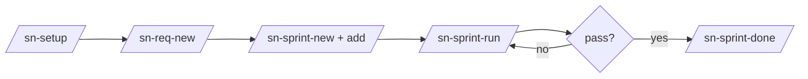

# setup-project-plugin

[](https://github.com/siripol/setup_project_plugin/actions/workflows/ci.yml)
[](https://codecov.io/gh/siripol/setup_project_plugin)
[](LICENSE)

Claude Code plugin shipping the **`sn-setup`** skill — scaffold Claude-powered projects (Tier 2 Agent SDK + Tier 3 Managed Agents) following Anthropic conventions and OpenAI harness engineering principles.

134 pytest cases. Repo: `https://github.com/siripol/setup_project_plugin`.



Full walkthrough in [`WORKFLOW.md`](WORKFLOW.md). Per-command reference in [`COMMANDS.md`](COMMANDS.md).

## Install

This plugin ships with a `.claude-plugin/marketplace.json` catalog (marketplace name `sn-setup`), so Claude Code can install it through the built-in `/plugin marketplace` flow without any external registry.

### 1. Claude Code marketplace (recommended)

Run these two slash commands inside any Claude Code session:

```
/plugin marketplace add https://github.com/siripol/setup_project_plugin
/plugin install setup-project-plugin@sn-setup
```

What each step does:

1. `/plugin marketplace add <source>` — registers the marketplace defined by `.claude-plugin/marketplace.json` at the source. Source may be:
   - **Full HTTPS URL (recommended)**: `https://github.com/siripol/setup_project_plugin` — no SSH key setup required.
   - GitHub shorthand: `siripol/setup_project_plugin` — uses SSH; needs `github.com` in your `~/.ssh/known_hosts` (`ssh-keyscan github.com >> ~/.ssh/known_hosts` once).
   - Local path: `/path/to/setup_project_plugin` (dev mode — auto-picks up `git pull` changes).
2. `/plugin install <plugin>@<marketplace>` — installs the plugin named `setup-project-plugin` from the `sn-setup` marketplace.

Manage the marketplace afterwards:

```
/plugin marketplace list             # show registered marketplaces
/plugin marketplace update sn-setup  # pull the latest catalog
/plugin marketplace remove sn-setup  # unregister
```

### 2. Direct from GitHub (no marketplace registration)

If you only want this one plugin and prefer not to register a marketplace:

```
/plugin install https://github.com/siripol/setup_project_plugin
```

Pin to a specific tag for reproducible installs:

```
/plugin install https://github.com/siripol/setup_project_plugin@v0.2.0
```

### 3. Local path (development / unpublished forks)

```bash
git clone https://github.com/siripol/setup_project_plugin /path/to/setup_project_plugin
```

Then inside Claude Code:

```
/plugin marketplace add /path/to/setup_project_plugin
/plugin install setup-project-plugin@sn-setup
```

The local-path source watches the directory, so a `git pull` (or a code edit) refreshes the install automatically — useful while iterating on the plugin itself.

### Verify the install

```
/plugin list                       # setup-project-plugin should appear
/sn-setup --help                   # entry slash command resolves
```

## Commands

- `/sn-setup [name] [flags]` — auto-detects mode from cwd.
  - **new mode** — empty cwd OR `name` arg → full scaffold + git init + commit.
  - **add mode** — non-empty cwd + no `name` → patches missing `.claude/` files only (idempotent via `.sn-init-state.json`).
  - **upgrade mode** — `--upgrade` re-runs the scaffold over an existing project, adds files that didn't exist yet, never overwrites user edits.
- `/sn-verify` (scaffolded) — checks `src/agent.{py,ts,go}` against the six mechanically-checkable [Agent SDK best practices](skills/sn-setup/templates/managed-agent-base/docs/principles/agent-sdk-best-practices.md). For prose-analysis rules invoke the `sn-agent-sdk-reviewer` subagent. See [`COMMANDS.md`](COMMANDS.md) for the full list of 18 generated commands + 9 subagents.

## Quickstart

```bash
mkdir my-agent && cd my-agent
/sn-setup demo                  # default lang=go, tier=both, workflow=spec-loop
cd demo
make help                      # show all generated Makefile targets
make agent                     # ant agents apply agents/main.yaml
export AGENT_ID=<id-from-output>
make session                   # start a Managed Agent session
```

## What the scaffold ships

```
<project>/
  AGENTS.md  CLAUDE.md  CLAUDE.local.md  README.md
  Makefile  .env.example  .gitignore  .editorconfig  .tool-versions
  agents/main.yaml + environments/default.yaml + mcp/mcp.json
  skills/example-skill/SKILL.md  .anthropic/
  src/{agent,client,orchestrator}.*  mcp_server/main.*  tests/
  docs/
    principles/{design,plans,product-sense,quality,reliability,security}.md
    design-docs/  product-specs/  references/*-llms.txt
    requirements/  sprints/  tech-debt-tracker.md
  .claude/
    settings.json + .local
    skills/  commands/  agents/  hooks/
  .harness/{rules,invariants,normal-forms,chokepoints.yaml,proof-bundle-template.md}
  .sn-init/{logs/,workflow-state.json,worktrees/,knowledge -> $OBSIDIAN_VAULT/knowledge/}
  .githooks/{commit-msg,post-merge,README.md}
  .sn-init-state.json
```

## Flag reference

```
/sn-setup [name]
  --lang=**go**|py|ts                           # stack overlay
  --tier=2|3|**both**                           # Anthropic tier
  --license=**none**|MIT|Apache-2.0
  [--no-git] [--install] [--retry=**3**]
  [--no-ci] [--devcontainer]
  [--obsidian[=PATH] | --no-obsidian]           # tracking note + KB vault
  --obsidian-knowledge=**project**|global       # default KB scope
  --obsidian-mcp=**auto**|on|off                # Obsidian MCP backend
  [--prompt="..."]                              # seed agents/main.yaml
  --subagents=**code-reviewer,test-writer**|all|none|LIST
  --workflow=**spec-loop**|none
  [--no-audit-log]
  [--upgrade]                                   # in-place template sync
  [--dry-run] [--verbose]
```

Defaults shown in **bold**. See [`commands/sn-setup.md`](commands/sn-setup.md) for the complete table.

For the end-to-end usage walkthrough (REQ → sprint → spec-loop → triple-signal gate → archive), see [`WORKFLOW.md`](WORKFLOW.md). The per-command reference (one section per `sn-*` slash command, plus the Make-target mirror table) is in [`COMMANDS.md`](COMMANDS.md).

## Three tiers, three langs

| | Tier 2 (Agent SDK) | Tier 3 (Managed Agents) |
|---|---|---|
| **Python** | `claude-agent-sdk` `query()` | `anthropic` `client.beta.sessions` |
| **TypeScript** | `@anthropic-ai/claude-agent-sdk` | `@anthropic-ai/sdk` `client.beta.sessions` |
| **Go** | `anthropic-sdk-go` `BetaToolRunner` | `anthropic-sdk-go` `client.Beta.Sessions` |

Default model: `claude-opus-4-8` with `thinking: {type: "adaptive"}`.

## Subagent library (14 shipped)

| Bucket | Subagents |
|---|---|
| Default (2) | `code-reviewer`, `test-writer` |
| Optional (`--subagents=all` or named) | `doc-writer`, `security-auditor`, `planner` |
| Workflow (`--workflow=spec-loop`) | `task-decomposer`, `task-executor`, `task-tester`, `integration-tester`, `evaluator`, `adversary`, `knowledge-curator`, `impact-analyzer` |

Each carries a capability manifest (`tools:`, `can_modify:`, `can_delegate:`, `chokepoint_gate:`) enforced by `.claude/hooks/chokepoint-gate.{sh,py,ts}`.

## Namespace

Generated commands and subagents are scaffolded with a flat `sn-` filename prefix (no subdir), so Claude Code surfaces them as `/sn-<name>` and `sn-<name>` — distinct from user-authored commands while keeping `/`-autocomplete a single sweep through the `sn-` block. The entry command itself stays `/sn-setup`.

Examples: `/sn-knowledge-update`, `/sn-sprint-run`, `/sn-req-new`, subagent `sn-knowledge-curator`.

## Spec-loop workflow

1. User writes `REQ-NNN-<slug>.md` into `docs/requirements/active/` (or `make req-import FILE=...`).
2. Group into sprints: `make sprint-new SLUG=...`, `make sprint-add SPRINT=... REQ=...`.
3. Run: `make sprint-run SPRINT=...` (orchestrator dispatches subagents, surfaced as `/sn-sprint-run` inside Claude Code).
4. **Mandatory pre-sprint impact check** — `sn-impact-analyzer` writes `impact.md`. Major impact → halt + `AskUserQuestion`.
5. Per REQ (topo-sorted): `sn-planner → sn-task-decomposer → sn-task-executor + sn-task-tester → sn-integration-tester → sn-adversary → sn-evaluator → sn-knowledge-curator → doc-writer`.
6. **Triple-signal exit gate**: `eval_score ≥ threshold` AND `integration.pass` AND `adversary.findings_resolved`.
7. On pass: `make sprint-done SPRINT=...` archives the whole folder to `docs/sprints/completed/`.

## Safety rails

| Rail | Trigger | State |
|---|---|---|
| Rate limit | `SN_MAX_CALLS_PER_HOUR=200`, `SN_MAX_TOKENS_PER_HOUR=2_000_000` | `.sn-init/workflow-state.json` `rate_window` |
| Chokepoint gate | Edit/Write to `.harness/chokepoints.yaml` paths | PreToolUse hook blocks |
| Circuit breaker | 3 no-progress OR 5 same-error cycles | `safety.py` trips + 5min cooldown |
| Pre-cycle git tag | every REQ | `sn-init/pre-REQ-NNN-<ts>` → `make req-rollback` |
| Audit log | every Claude event | `.sn-init/logs/exec-<date>-<session>.jsonl` |
| Capability manifest | subagent writes outside `can_modify` | PreToolUse hook blocks |

## Obsidian-backed knowledge

3 buckets in `$OBSIDIAN_VAULT/knowledge/`:

- `projects/<project>/<topic>.md` — project-domain facts (default scope).
- `global/shared/<topic>.md` — cross-project policies + contracts.
- `global/tech/<project>/<topic>.md` — tech facts categorized by origin project.

Backend selection: `--obsidian-mcp=auto|on|off`. Auto probes MCP (`mcp__obsidian__*`, `mcp__mcp-obsidian__*`, `mcp__obsidian-mcp__*`); falls back to filesystem `Write` via `scripts/obsidian_client.py`. Both write to identical paths.

Every fact carries `traceback:` frontmatter: `origin_project`, `origin_req`, `origin_sprint`, `first_seen`, `last_updated`. Cross-link via `[[wiki-links]]`.

This repo's own knowledge lives in `/Users/siripol/Claude/obsidian_sharedknowledge/AllSharedKnowledge/knowledge/`.

## Audit log

```jsonl
{"ts":"...","session_id":"...","event":"PostToolUse","tool_name":"Read","tool_input":{...},"usage":{"input_tokens":N,"output_tokens":N},"duration_ms":N}
```

`make logs-tail` (jq + tail -F), `make logs-stats` (tool + token summary). Truncates payloads >2KB to blob files in `.sn-init/logs/blobs/`.

## Git hooks (opt-in)

```bash
make hooks-install      # points git at .githooks/
```

- `commit-msg` — rejects subjects without REQ-NNN unless prefixed `chore:`, `wip:`, or `docs:`.
- `post-merge` — closes the matching GitHub issue when a `req/REQ-NNN` branch lands.

## Development

```bash
# plugin self-tests (84 cases)
uv run --with pytest pytest tests/

# manual scaffold to a tmp dir
python3 scripts/sn_init.py /tmp/snitest --dry-run
```

Repo layout:

```
setup_project_plugin/
  .claude-plugin/plugin.json
  commands/sn-setup.md
  hooks/README.md
  scripts/{sn_init,errors,sn_logging,safety,orchestrator,obsidian_client,req_import,gen_subagent_index}.py
  scripts/importers/{md,txt,json,docx,pdf}.py
  skills/sn-setup/SKILL.md + templates/
  tests/test_sn_init.py
  COMMANDS.md  README.md  LICENSE  CHANGELOG.md
```

## Changelog

Versioned release notes live in [`CHANGELOG.md`](CHANGELOG.md). Plugin version is sourced from `.claude-plugin/plugin.json` (currently `0.2.0`). Each release entry calls out renamed identifiers, added features, behavior changes, and a `Vault (obsidian_sharedknowledge)` subsection that lists the knowledge-mirror commits shipped alongside the plugin batch.

## License

MIT — see `LICENSE`.
