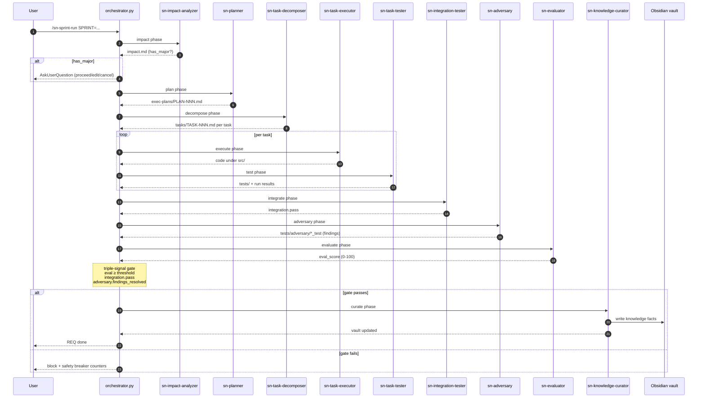
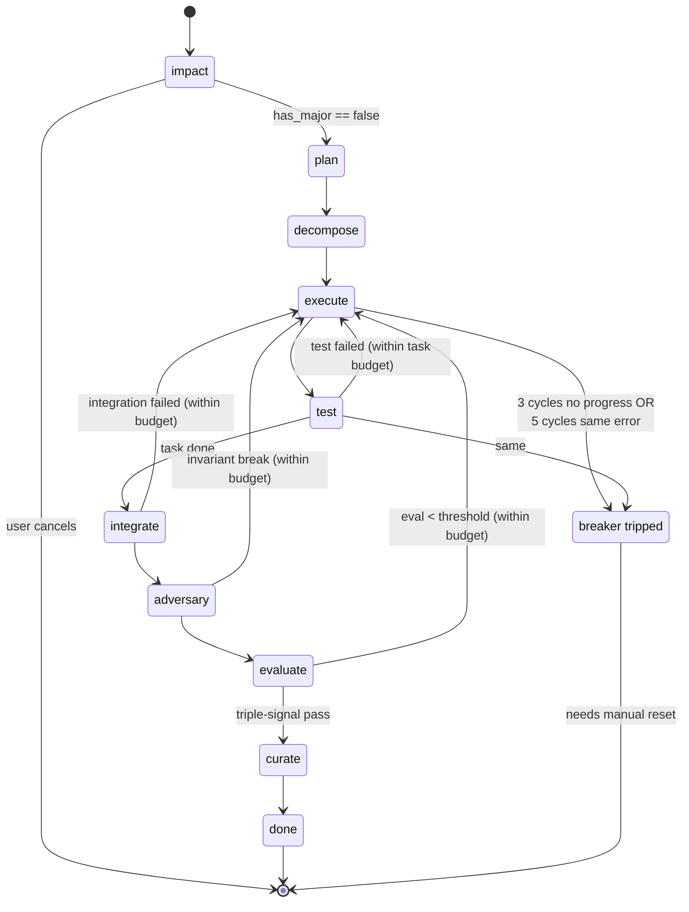

# Workflow — from a new requirement to a passing test

This walks through the full `sn-*` command flow inside a scaffolded project: write a requirement → bundle it into a sprint → run the spec-loop → see it pass the triple-signal gate → archive. Run every command in this guide inside a Claude Code session that has the `setup-project-plugin` installed.

## At a glance — command flow

```mermaid
flowchart TD
    A([install plugin]) --> B[/sn-setup &lt;name&gt;/]
    B --> C{REQ source?}
    C -- write from scratch --> D[/sn-req-new SLUG=.../]
    C -- import md/pdf/docx --> E[/sn-req-import FILE=.../]
    C -- pull GitHub issues --> F[/sn-gh-import/]
    D --> G[edit REQ-NNN.md]
    E --> G
    F --> G
    G --> H[/sn-sprint-new SLUG=.../]
    H --> I[/sn-sprint-add SPRINT=... REQ=.../]
    I --> J{more REQs?}
    J -- yes --> I
    J -- no --> K[/sn-knowledge-check SPRINT=.../]
    K --> L{major impact?}
    L -- yes --> G
    L -- no --> M[/sn-sprint-run SPRINT=.../]
    M --> N{triple-signal pass?}
    N -- no --> O[/sn-req-rollback or fix code]
    O --> M
    N -- yes --> P[/sn-sprint-done SPRINT=.../]
    P --> Q([sn-knowledge-curator → vault])
    Q --> R([archived in docs/sprints/completed/])

    classDef cmd fill:#dbeafe,stroke:#1d4ed8,color:#0c2858;
    classDef gate fill:#fef3c7,stroke:#b45309,color:#3b2207;
    classDef done fill:#dcfce7,stroke:#15803d,color:#0c3a1a;
    class B,D,E,F,H,I,K,M,P cmd;
    class C,J,L,N gate;
    class A,Q,R done;
```

## Spec-loop subagent sequence

What `/sn-sprint-run` does internally for one REQ. Each phase is one subagent invocation by `scripts/orchestrator.py`; arrows are state transitions; the last three steps form the triple-signal gate.



## State machine

The orchestrator persists every transition to `.sn-init/workflow-state.json`. The state graph below shows what happens between phases; `/sn-req-resume` re-enters at whichever state is current.



## Prerequisites

```
/plugin marketplace add https://github.com/siripol/setup_project_plugin
/plugin install setup-project-plugin@sn-setup
```

Then you have `/sn-setup` available.

## 0. Scaffold a project (one-time setup)

```
/sn-setup my-agent --lang=py
```

What lands on disk:

```
my-agent/
  .claude/{settings.json, commands/sn-*.md, agents/sn-*.md, hooks/*}
  .harness/{rules,invariants,normal-forms,chokepoints.yaml}
  .sn-init/                       # runtime state (logs, worktrees, workflow-state.json)
  .sn-init-state.json             # scaffolder state
  src/, mcp_server/, tests/        # python stack
  docs/{requirements,sprints,principles,design-docs,references}
  Makefile  README.md  CLAUDE.md  ...
```

Open `my-agent/` in Claude Code (`cd my-agent` in your terminal, or open it as the working directory) so the project-local `sn-*` commands appear in autocomplete.

```bash
cd my-agent
claude  # restart Claude Code session if commands don't appear immediately
```

## 1. Create a new requirement

Two ways — pick whichever fits your input.

### 1a. From scratch (`/sn-req-new`)

```
/sn-req-new SLUG=login-flow
```

Result: `docs/requirements/active/REQ-001-login-flow.md` is created from `docs/requirements/template.md`. Edit the file — fill in the title, acceptance criteria bullets, and any `requires:` / `eval_threshold:` fields.

### 1b. From an existing document (`/sn-req-import`)

```
/sn-req-import FILE=docs/external-spec.pdf
```

Result: the importer runs the appropriate parser (`md` / `txt` / `json` / `docx` / `pdf`), extracts the title and acceptance bullets, and writes `docs/requirements/active/REQ-NNN-<slug>.md`. Always review and edit before continuing.

### What "good" looks like

```markdown
---
id: REQ-001
title: Login flow
priority: high
requires: []
eval_threshold: 70
---

## Acceptance criteria

- A user can log in with email + password.
- Session expires after 15 minutes idle.
- Failed login increments a per-IP counter.
```

One bullet per acceptance criterion. Keep them testable.

## 2. Group requirements into a sprint

A sprint is a folder under `docs/sprints/active/` that bundles related REQs to run together.

```
/sn-sprint-new SLUG=auth-rev
```

Result: `docs/sprints/active/SPRINT-001-auth-rev/` with subfolders `requirements/`, `exec-plans/`, `tasks/`, `proof/` and a `sprint.md` manifest.

Add your REQ:

```
/sn-sprint-add SPRINT=SPRINT-001 REQ=REQ-001
```

The REQ moves from `docs/requirements/active/` into the sprint's `requirements/` subfolder and its id is appended to the sprint's `reqs:` list.

Repeat `/sn-sprint-add` for each requirement that belongs in this sprint. Topological order (the `requires:` field on each REQ) is resolved automatically when the sprint runs.

Inspect:

```
/sn-sprint-status
```

You should see your sprint in the active list with `REQs 1` and `status: planning`.

## 3. (Optional) Preview the impact

Before kicking off the sprint, run an impact check that only invokes `sn-impact-analyzer` — it reads every Obsidian knowledge file and every other active sprint and reports whether your REQ would touch a major contract.

```
/sn-knowledge-check SPRINT=SPRINT-001
```

Result: `docs/sprints/active/SPRINT-001-auth-rev/impact.md` with `Affected topics`, `Conflicting facts`, `Major impacts`, `Minor impacts`. No code change, no commits.

If the report flags `HIGH` impacts, edit the REQ or the existing knowledge files before running the sprint.

## 4. Run the spec-loop

This is the main command. It dispatches the full chain of `sn-*` subagents and only stops on a major impact or on a failure of the triple-signal exit gate.

```
/sn-sprint-run SPRINT=SPRINT-001
```

What happens for each REQ, in order:

| Phase | Subagent | What it produces |
|---|---|---|
| impact | `sn-impact-analyzer` | `impact.md` — halts on `has_major: true` |
| plan | `sn-planner` (optional) | `exec-plans/PLAN-NNN.md` |
| decompose | `sn-task-decomposer` | `tasks/TASK-NNN.md` per task |
| execute | `sn-task-executor` | code changes under `src/` |
| test | `sn-task-tester` | new tests under `tests/` |
| integrate | `sn-integration-tester` | cross-task integration test pass |
| adversary | `sn-adversary` | new failing test for each invariant break under `tests/adversary/` |
| evaluate | `sn-evaluator` | `eval_score` 0-100 against acceptance criteria |
| curate | `sn-knowledge-curator` | new entries in the Obsidian knowledge vault |

Before each REQ starts, a `sn-init/pre-REQ-NNN-<ts>` git tag is laid down so you can roll back with `/sn-req-rollback REQ=REQ-NNN` if things go wrong.

State is written to `.sn-init/workflow-state.json` after every phase. If your session crashes mid-run, restart and run:

```
/sn-req-resume
```

The orchestrator picks up at the last completed phase.

## 5. Triple-signal exit gate

A REQ passes only when **all three** of these are true:

1. `eval_score ≥ eval_threshold` from `sn-evaluator`.
2. `integration.pass` from `sn-integration-tester`.
3. `adversary.findings_resolved` from `sn-adversary` — every break the adversary found has a matching passing test in `tests/adversary/`.

If any of the three is false, the orchestrator stops, reports which signal blocked, and the safety circuit breaker will trip after 3 cycles without progress or 5 cycles of the same error.

Manual inspection:

```bash
make safety-status                  # rate limit + breaker state
make logs-tail                      # JSONL audit log of every subagent call
make logs-stats                     # tool + token usage summary per session
```

## 6. Archive the sprint

Once every REQ in the sprint has reached `eval pass`:

```
/sn-sprint-done SPRINT=SPRINT-001
```

This:

- Refuses if any REQ is still in a non-pass state.
- Moves `docs/sprints/active/SPRINT-001-auth-rev/` into `docs/sprints/completed/`.
- Runs `sn-knowledge-curator` one more time to refresh the Obsidian buckets and regenerate the cross-project tech matrix at `<vault>/knowledge/global/tech/README.md`.

## 7. Knowledge mirror (automatic, but you can rerun it)

`sn-knowledge-curator` already ran at the end of the sprint, but you can refresh the vault on demand:

```
/sn-knowledge-update                                # idempotent, re-reads every completed REQ
/sn-knowledge-promote TOPIC=auth-policy             # projects/<p>/<topic>.md → global/shared/
/sn-knowledge-demote  TOPIC=auth-policy             # global/shared/ → projects/<p>/
/sn-knowledge-tech-matrix                           # regen cross-project tech table only
```

Each writes through `scripts/obsidian_client.py`, which probes MCP (`mcp__obsidian__*`, `mcp__mcp-obsidian__*`, `mcp__obsidian-mcp__*`) first and falls back to direct filesystem writes if no Obsidian MCP server is reachable.

## 8. GitHub import (optional)

If your REQs live as GitHub issues labeled `req`:

```
/sn-gh-import
```

Runs `gh issue list --label req --state open --json number,title,body`, converts each issue into a REQ scaffold, and writes them to `docs/requirements/active/`. Requires the `gh` CLI to be authenticated.

`make gh-close REQ=REQ-001 PR=42` then closes the matching GitHub issue when the PR merges.

## End-to-end example — one terminal session

```bash
# Scaffold
cd /tmp
/sn-setup demo-auth --lang=py --no-git --no-ci --no-obsidian
cd demo-auth

# REQ
/sn-req-new SLUG=login-flow
# (edit docs/requirements/active/REQ-001-login-flow.md to fill in acceptance criteria)

# Sprint
/sn-sprint-new SLUG=auth-rev
/sn-sprint-add SPRINT=SPRINT-001 REQ=REQ-001

# Preview impact, optional
/sn-knowledge-check SPRINT=SPRINT-001

# Run the spec-loop
/sn-sprint-run SPRINT=SPRINT-001

# Archive
/sn-sprint-done SPRINT=SPRINT-001
```

After `sprint-done`:

- `docs/sprints/completed/SPRINT-001-auth-rev/` holds the REQ, plan, tasks, proof bundle, and `impact.md`.
- `src/` contains the implementation.
- `tests/` contains the unit + integration tests; `tests/adversary/` contains the regression tests for every invariant the adversary tried to break.
- `<vault>/knowledge/projects/demo-auth/` has new facts curated from the REQ (auth-policy, session-ttl, etc.).
- `.sn-init/logs/exec-*.jsonl` has the full audit log for the session.

## Recovery cheat sheet

| Situation | Command |
|---|---|
| Session crashed mid-sprint | `/sn-req-resume` |
| REQ failed, want to start over from the pre-REQ baseline | `/sn-req-rollback REQ=REQ-NNN` |
| Regression check a completed REQ against current deps | `/sn-req-replay REQ=REQ-NNN` |
| REQ should not be in this sprint after all | `/sn-sprint-remove SPRINT=... REQ=...` |
| Knowledge fact turned out to be project-specific | `/sn-knowledge-demote TOPIC=...` |
| Knowledge fact applies org-wide | `/sn-knowledge-promote TOPIC=...` |
| Circuit breaker tripped on a REQ | `make safety-reset-breaker REQ=REQ-NNN` |
| Rate-limit hit | `make safety-reset-rate-limit` |

## See also

- [`COMMANDS.md`](COMMANDS.md) — per-command reference with exit codes and Make-target mirror.
- [`README.md`](README.md) — top-level overview, install, file tree, safety rails, Obsidian KB layout.
- [`CHANGELOG.md`](CHANGELOG.md) — release notes, including vault commits per batch.
- `skills/sn-setup/templates/managed-agent-base/Makefile` — every Make target shipped to a scaffolded project (one mirror per slash command, plus extras for safety, worktrees, hooks).
