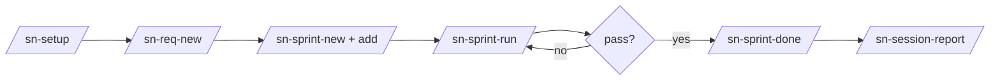
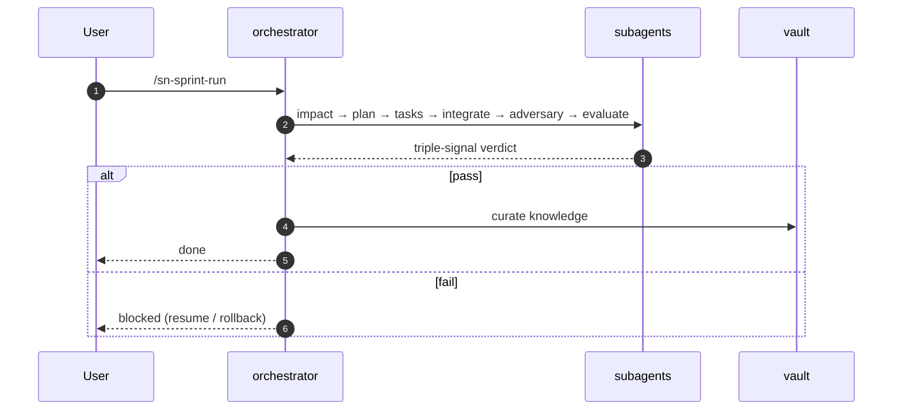
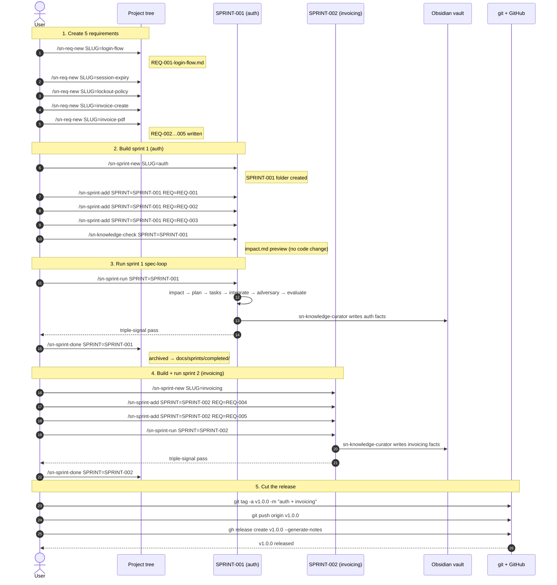

# Workflow — from a new requirement to a passing test

This walks through the full `sn-*` command flow inside a scaffolded project: write a requirement → bundle it into a sprint → run the spec-loop → see it pass the triple-signal gate → archive. Run every command in this guide inside a Claude Code session that has the `setup-project-plugin` installed.

## Command flow



`/sn-session-report` (v0.6.0+) closes the loop — after a sprint lands, it renders a tunability-ranked usage report into the Obsidian vault so the next sprint can target the highest-ROI prompts. See [§9](#9-session-usage-analysis--sn-session-report-v060).

## Inside `/sn-sprint-run`



## Prerequisites

```
/plugin marketplace add https://github.com/siripol/setup_project_plugin
/plugin install setup-project-plugin@sn-setup
```

Then you have `/sn-setup` available.

## 0. Scaffold a project (one-time setup)

```
/sn-setup my-agent --lang=py
```

What lands on disk:

```
my-agent/
  .claude/{settings.json, commands/sn-*.md, agents/sn-*.md, hooks/*}
  .harness/{rules,invariants,normal-forms,chokepoints.yaml}
  .sn-init/                       # runtime state (logs, worktrees, workflow-state.json)
  .sn-init-state.json             # scaffolder state
  src/, mcp_server/, tests/        # python stack
  docs/{requirements,sprints,principles,design-docs,references}
  Makefile  README.md  CLAUDE.md  ...
```

Open `my-agent/` in Claude Code (`cd my-agent` in your terminal, or open it as the working directory) so the project-local `sn-*` commands appear in autocomplete.

```bash
cd my-agent
claude  # restart Claude Code session if commands don't appear immediately
```

## 1. Create a new requirement

Two ways — pick whichever fits your input.

### 1a. From scratch (`/sn-req-new`)

```
/sn-req-new SLUG=login-flow
```

Result: `docs/requirements/active/REQ-001-login-flow.md` is created from `docs/requirements/template.md`. Edit the file — fill in the title, acceptance criteria bullets, and any `requires:` / `eval_threshold:` fields.

### 1b. From an existing document (`/sn-req-import`)

```
/sn-req-import FILE=docs/external-spec.pdf
```

Result: the importer runs the appropriate parser (`md` / `txt` / `json` / `docx` / `pdf`), extracts the title and acceptance bullets, and writes `docs/requirements/active/REQ-NNN-<slug>.md`. Always review and edit before continuing.

### What "good" looks like

```markdown
---
id: REQ-001
title: Login flow
priority: high
requires: []
eval_threshold: 70
---

## Acceptance criteria

- A user can log in with email + password.
- Session expires after 15 minutes idle.
- Failed login increments a per-IP counter.
```

One bullet per acceptance criterion. Keep them testable.

### Validate the REQ frontmatter

Before assigning a REQ to a sprint, run:

```bash
make req-validate
```

`scripts/req_validate.py` reads `docs/requirements/req-schema.json` (Draft 2020-12) and checks every active + assigned REQ has well-formed frontmatter — `id` matches `^REQ-[0-9]{3}$`, `priority in {high, medium, low}`, `acceptance` is a non-empty list, `eval_threshold` in 0..100, etc. Exit code `2` lists every offence with `::error file=…:: <path>: <message>` so a CI run catches malformed REQs before the orchestrator picks them up.

Optional deps: `pyyaml`, `jsonschema`. Missing deps print an install hint and exit 0.

## 2. Group requirements into a sprint

A sprint is a folder under `docs/sprints/active/` that bundles related REQs to run together.

```
/sn-sprint-new SLUG=auth-rev
```

Result: `docs/sprints/active/SPRINT-001-auth-rev/` with subfolders `requirements/`, `exec-plans/`, `tasks/`, `proof/` and a `sprint.md` manifest.

Add your REQ:

```
/sn-sprint-add SPRINT=SPRINT-001 REQ=REQ-001
```

The REQ moves from `docs/requirements/active/` into the sprint's `requirements/` subfolder and its id is appended to the sprint's `reqs:` list.

Repeat `/sn-sprint-add` for each requirement that belongs in this sprint. Topological order (the `requires:` field on each REQ) is resolved automatically when the sprint runs.

Inspect:

```
/sn-sprint-status
```

You should see your sprint in the active list with `REQs 1` and `status: planning`.

## 3. (Optional) Preview the impact

Before kicking off the sprint, run an impact check that only invokes `sn-impact-analyzer` — it reads every Obsidian knowledge file and every other active sprint and reports whether your REQ would touch a major contract.

```
/sn-knowledge-check SPRINT=SPRINT-001
```

Result: `docs/sprints/active/SPRINT-001-auth-rev/impact.md` with `Affected topics`, `Conflicting facts`, `Major impacts`, `Minor impacts`. No code change, no commits.

If the report flags `HIGH` impacts, edit the REQ or the existing knowledge files before running the sprint.

## 4. Run the spec-loop

This is the main command. It dispatches the full chain of `sn-*` subagents and only stops on a major impact or on a failure of the triple-signal exit gate.

```
/sn-sprint-run SPRINT=SPRINT-001
```

What happens for each REQ, in order:

| Phase | Subagent | What it produces |
|---|---|---|
| impact | `sn-impact-analyzer` | `impact.md` — halts on `has_major: true` |
| plan | `sn-planner` (optional) | `exec-plans/PLAN-NNN.md` |
| decompose | `sn-task-decomposer` | `tasks/TASK-NNN.md` per task |
| execute | `sn-task-executor` | code changes under `src/` |
| test | `sn-task-tester` | new tests under `tests/` |
| integrate | `sn-integration-tester` | cross-task integration test pass |
| adversary | `sn-adversary` | new failing test for each invariant break under `tests/adversary/` |
| evaluate | `sn-evaluator` | `eval_score` 0-100 against acceptance criteria |
| curate | `sn-knowledge-curator` | new entries in the Obsidian knowledge vault |

Before each REQ starts, a `sn-init/pre-REQ-NNN-<ts>` git tag is laid down so you can roll back with `/sn-req-rollback REQ=REQ-NNN` if things go wrong.

State is written to `.sn-init/workflow-state.json` after every phase. If your session crashes mid-run, restart and run:

```
/sn-req-resume
```

The orchestrator picks up at the last completed phase.

## 5. Triple-signal exit gate

A REQ passes only when **all three** of these are true:

1. `eval_score ≥ eval_threshold` from `sn-evaluator`.
2. `integration.pass` from `sn-integration-tester`.
3. `adversary.findings_resolved` from `sn-adversary` — every break the adversary found has a matching passing test in `tests/adversary/`.

If any of the three is false, the orchestrator stops, reports which signal blocked, and the safety circuit breaker will trip after 3 cycles without progress or 5 cycles of the same error.

Manual inspection:

```bash
make safety-status                  # rate limit + breaker state
make logs-tail                      # JSONL audit log of every subagent call
make logs-stats                     # tool + token usage summary per session
make check-invariants               # list .harness/invariants/ + their test files
```

### Harness invariants (`.harness/invariants/`)

The scaffold ships three seed invariants the `sn-adversary` subagent must respect — each is a small `.md` file with a paired test:

- `capability-manifest-respected.md` — every Edit/Write hits a path inside the active subagent's `can_modify:` glob list. Replays the JSONL audit log.
- `state-file-monotonic.md` — `.sn-init/workflow-state.json` `phase_history` is append-only with monotonic UTC timestamps. Underpins safe `/sn-req-resume`.
- `audit-log-complete.md` — every `PreToolUse` audit record has a matching `PostToolUse` with the same `tool_use_id`. Catches killed shells, hook crashes, log corruption.

Add a new invariant when a sprint adds an architectural rule that the codebase must keep honouring. The adversary will read your invariant body during the next sprint and try to falsify it.

## 6. Archive the sprint

Once every REQ in the sprint has reached `eval pass`:

```
/sn-sprint-done SPRINT=SPRINT-001
```

This:

- Refuses if any REQ is still in a non-pass state.
- Moves `docs/sprints/active/SPRINT-001-auth-rev/` into `docs/sprints/completed/`.
- Runs `sn-knowledge-curator` one more time to refresh the Obsidian buckets and regenerate the cross-project tech matrix at `<vault>/knowledge/global/tech/README.md`.

## 7. Knowledge mirror (automatic, but you can rerun it)

`sn-knowledge-curator` already ran at the end of the sprint, but you can refresh the vault on demand:

```
/sn-knowledge-update                                # idempotent, re-reads every completed REQ
/sn-knowledge-promote TOPIC=auth-policy             # projects/<p>/<topic>.md → global/shared/
/sn-knowledge-demote  TOPIC=auth-policy             # global/shared/ → projects/<p>/
/sn-knowledge-tech-matrix                           # regen cross-project tech table only
```

Each writes through `scripts/obsidian_client.py`, which probes MCP (`mcp__obsidian__*`, `mcp__mcp-obsidian__*`, `mcp__obsidian-mcp__*`) first and falls back to direct filesystem writes if no Obsidian MCP server is reachable.

## 8. GitHub import (optional)

If your REQs live as GitHub issues labeled `req`:

```
/sn-gh-import
```

Runs `gh issue list --label req --state open --json number,title,body`, converts each issue into a REQ scaffold, and writes them to `docs/requirements/active/`. Requires the `gh` CLI to be authenticated.

`make gh-close REQ=REQ-001 PR=42` then closes the matching GitHub issue when the PR merges.

## 9. Session-usage analysis — `/sn-session-report` (v0.6.0+)

After a sprint (or any session burn), render a project-scoped usage report into the vault to see **which prompts to tune**, not just which were expensive:

```
/sn-session-report 7d           # default window; auto-commits the vault
/sn-session-report 24h --dry-run
/sn-session-report --no-push    # write + commit but don't push
```

The report lands at `<vault>/projects/<project>/session-reports/YYYY-MM-DD_HHMM.md` and includes:

- **Top prompts (by tunability)** — sorted by a 0-100 composite score (repeat count + cache-miss share + subagent fan-out + API-call thrash + cache-break recurrence), NOT raw tokens. Each row tagged with a `reason` code: `repeat`, `subagent-heavy`, `loop-thrash`, `cache-miss`, `cold-start`, `low-output`, `expensive`.
- **Repeated prompts (skill candidates)** — prompts typed ≥ 3 times this window. Highest-ROI tuning targets: promote each to a `/sn-<slug>` skill or CLAUDE.md macro and you stop paying the cache-miss tax on every replay.
- **Optimizations** — top-5 per-prompt punch list pairing the reason code with one concrete fix (e.g. `repeat` → promote to skill; `subagent-heavy` → scope fewer parallel agents; `loop-thrash` → lower `max_turns`; `cache-miss` → pin CLAUDE.md before commits).

Wraps Anthropic's upstream [`session-report`](https://github.com/anthropics/claude-plugins-official/tree/main/plugins/session-report) plugin's analyzer (`analyze-sessions.mjs`); install it once via `/plugin marketplace add anthropics/claude-plugins-official` then `/plugin install session-report@claude-plugins-official`. Missing analyzer → exit 9 with install hint. See `commands/sn-session-report.md` for the full reading guide and `skills/session-report/SKILL.md` for the 9-step flow.

Scaffolded projects ship the same `/sn-session-report` command + a `make session-report` Make target (with `SINCE=24h|7d|30d|all` env override).

## End-to-end example — one terminal session

```bash
# Scaffold
cd /tmp
/sn-setup demo-auth --lang=py --no-git --no-ci --no-obsidian
cd demo-auth

# REQ
/sn-req-new SLUG=login-flow
# (edit docs/requirements/active/REQ-001-login-flow.md to fill in acceptance criteria)

# Sprint
/sn-sprint-new SLUG=auth-rev
/sn-sprint-add SPRINT=SPRINT-001 REQ=REQ-001

# Preview impact, optional
/sn-knowledge-check SPRINT=SPRINT-001

# Run the spec-loop
/sn-sprint-run SPRINT=SPRINT-001

# Archive
/sn-sprint-done SPRINT=SPRINT-001
```

After `sprint-done`:

- `docs/sprints/completed/SPRINT-001-auth-rev/` holds the REQ, plan, tasks, proof bundle, and `impact.md`.
- `src/` contains the implementation.
- `tests/` contains the unit + integration tests; `tests/adversary/` contains the regression tests for every invariant the adversary tried to break.
- `<vault>/knowledge/projects/demo-auth/` has new facts curated from the REQ (auth-policy, session-ttl, etc.).
- `.sn-init/logs/exec-*.jsonl` has the full audit log for the session.

## Worked example — 5 REQs, 2 sprints, one release

A concrete scenario: you have five requirements for a `payments` service. You group them into two sprints (auth + invoicing), run them in order, and cut a release once both are archived.

### Sequence diagram

Each arrow is one slash command. Activations show which sprint or release surface owns the next step. Notes call out what the command produces on disk.



### Step-by-step commands with explanations

#### Step 1 — Create 5 requirements

```
/sn-req-new SLUG=login-flow         # → REQ-001
/sn-req-new SLUG=session-expiry     # → REQ-002
/sn-req-new SLUG=lockout-policy     # → REQ-003
/sn-req-new SLUG=invoice-create     # → REQ-004
/sn-req-new SLUG=invoice-pdf        # → REQ-005
```

What each `/sn-req-new` does:

- Scans `docs/requirements/active/` and every sprint dir to find the max `REQ-NNN`, then increments. So calling it five times in a row gives you `REQ-001` through `REQ-005` automatically.
- Copies `docs/requirements/template.md` into `docs/requirements/active/REQ-NNN-<slug>.md`.
- Replaces the `REQ-NNN` placeholder in the template with the real id.

After the five calls, edit each file to fill in:
- `title:`, `priority:`, `requires:` (cross-REQ deps), `eval_threshold:` in frontmatter.
- The `## Acceptance criteria` bullet list — one testable bullet per criterion.

For this scenario, set `requires: [REQ-001]` on `REQ-004-invoice-create.md` so the orchestrator runs auth before invoicing across sprints.

#### Step 2 — Build sprint 1 (auth: REQ-001..003)

```
/sn-sprint-new SLUG=auth                       # → SPRINT-001
/sn-sprint-add SPRINT=SPRINT-001 REQ=REQ-001
/sn-sprint-add SPRINT=SPRINT-001 REQ=REQ-002
/sn-sprint-add SPRINT=SPRINT-001 REQ=REQ-003
/sn-knowledge-check SPRINT=SPRINT-001          # optional preview
```

What happens:

- `/sn-sprint-new` creates `docs/sprints/active/SPRINT-001-auth/` with subfolders (`requirements/`, `exec-plans/`, `tasks/`, `proof/`) and a `sprint.md` manifest with `status: planning`.
- Each `/sn-sprint-add` moves a REQ from `docs/requirements/active/` into the sprint's `requirements/` subfolder and appends the id to `sprint.md`'s `reqs:` list.
- `/sn-knowledge-check` runs only the `sn-impact-analyzer` subagent and writes `impact.md` — no code changes, no commits. If the report flags `HIGH` impacts (e.g. "REQ-002 changes the session-TTL contract used by other projects"), edit the REQ or the existing Obsidian knowledge files before running the sprint.

#### Step 3 — Run sprint 1 spec-loop

```
/sn-sprint-run SPRINT=SPRINT-001
/sn-sprint-done SPRINT=SPRINT-001
```

What happens:

- `/sn-sprint-run` dispatches the orchestrator through every REQ in topological order (`requires:` field): impact → plan → decompose → execute → test → integrate → adversary → evaluate → curate. Each phase is one subagent call; `.sn-init/workflow-state.json` is updated after every phase so `/sn-req-resume` can pick up after a crash.
- Each REQ has to pass the triple-signal gate (`eval_score ≥ threshold AND integration.pass AND adversary.findings_resolved`) before the orchestrator moves on.
- On all-pass, `sn-knowledge-curator` writes `projects/payments/auth-policy.md`, `session-ttl.md`, `lockout-counter.md` to the Obsidian vault.
- `/sn-sprint-done` refuses if any REQ is still non-pass; otherwise it moves the whole `SPRINT-001-auth/` folder into `docs/sprints/completed/` and re-runs the curator once to regenerate the cross-project tech matrix.

#### Step 4 — Build + run sprint 2 (invoicing: REQ-004..005)

```
/sn-sprint-new SLUG=invoicing                  # → SPRINT-002
/sn-sprint-add SPRINT=SPRINT-002 REQ=REQ-004
/sn-sprint-add SPRINT=SPRINT-002 REQ=REQ-005
/sn-sprint-run SPRINT=SPRINT-002
/sn-sprint-done SPRINT=SPRINT-002
```

Same shape as sprint 1 with two REQs and the optional knowledge-check skipped. Because `REQ-004` declared `requires: [REQ-001]`, the orchestrator reads the completed REQs from `docs/sprints/completed/SPRINT-001-auth/` and lets the dependency resolve without any extra ceremony.

#### Step 5 — Cut the release

```
git tag -a v1.0.0 -m "v1.0.0 — auth + invoicing"
git push origin v1.0.0
```

What happens:

- `git tag -a` lays down an annotated tag at the current `HEAD`. Every commit on this branch since the last tag was made under the scaffolded `commit-msg` git hook, so the subjects already contain `REQ-NNN` markers (e.g. `feat(REQ-001): wire login flow`).
- `git push origin v1.0.0` publishes the tag to GitHub.
- The `.github/workflows/release.yml` workflow fires on the tag push. It extracts the matching `## [v1.0.0]` block from `CHANGELOG.md` via an awk window and runs `gh release create v1.0.0 --notes-file <slice>`. If the CHANGELOG has no matching section, it falls back to `gh release create --generate-notes` so commit subjects still appear in the release body. No manual `gh release create` step.

Maintain `CHANGELOG.md` `## [Unreleased]` while you work; rename the section to `## [v1.0.0] — YYYY-MM-DD` right before tagging so the workflow picks up your hand-written notes.

### One-shot script

If you prefer to run the whole example as one shell session (after editing the REQ files between step 1 and step 2):

```bash
# Step 1 — 5 REQs
/sn-req-new SLUG=login-flow
/sn-req-new SLUG=session-expiry
/sn-req-new SLUG=lockout-policy
/sn-req-new SLUG=invoice-create
/sn-req-new SLUG=invoice-pdf
# edit each REQ-NNN-*.md, then continue

# Step 2 — sprint 1 build
/sn-sprint-new SLUG=auth
for r in REQ-001 REQ-002 REQ-003; do /sn-sprint-add SPRINT=SPRINT-001 REQ=$r; done
/sn-knowledge-check SPRINT=SPRINT-001

# Step 3 — sprint 1 run + archive
/sn-sprint-run  SPRINT=SPRINT-001
/sn-sprint-done SPRINT=SPRINT-001

# Step 4 — sprint 2
/sn-sprint-new SLUG=invoicing
for r in REQ-004 REQ-005; do /sn-sprint-add SPRINT=SPRINT-002 REQ=$r; done
/sn-sprint-run  SPRINT=SPRINT-002
/sn-sprint-done SPRINT=SPRINT-002

# Step 5 — release
git tag -a v1.0.0 -m "v1.0.0 — auth + invoicing"
git push origin v1.0.0
gh release create v1.0.0 --generate-notes
```

## Autonomous mode — combine with Ralph Wiggum (official plugin)

For unattended sprint runs, pair this plugin with Anthropic's official [`ralph-wiggum`](https://github.com/anthropics/claude-code/tree/main/plugins/ralph-wiggum) plugin. Ralph wraps any prompt in a `while true` loop that re-feeds the prompt every iteration until a completion-promise string appears in stdout.

No wrapper command is needed — Ralph integrates directly with `/sn-sprint-run`. The orchestrator (`scripts/orchestrator.py`) is the load-bearing piece: it emits the `DONE:` / `BLOCKED:` promise strings verbatim on stdout via `_emit_promise()`, so Ralph's pattern match works out of the box without any extra glue.

### One-time install

```
/plugin install ralph-wiggum
```

### Run a sprint autonomously

```
/ralph-loop "/sn-sprint-run SPRINT=SPRINT-001" \
  --max-iterations 20 \
  --completion-promise "DONE: SPRINT-001 triple-signal pass" \
  --halt-promise       "BLOCKED: SPRINT-001"
```

| Flag | Meaning |
|---|---|
| Positional prompt | `/sn-sprint-run SPRINT=<id>` — the inner command this plugin already ships |
| `--max-iterations` | Secondary ceiling. The `scripts/safety.py` circuit breaker is the primary stop |
| `--completion-promise` | The orchestrator emits `DONE: <SPRINT-id> triple-signal pass` exactly once when the triple-signal gate passes and `sn-knowledge-curator` finishes writing facts |
| `--halt-promise` | Prefix-matches all three `BLOCKED:` reasons (`breaker tripped`, `rate-limit exhausted`, `max iterations reached`) so Ralph terminates on any safety stop |

### Safety + hook coexistence

- The `scripts/safety.py` circuit breaker (3 no-progress OR 5 same-error cycles) is the **authority**. Ralph's `--max-iterations` is a paranoid secondary ceiling.
- A `BLOCKED:` promise always wins over `DONE:`. Ralph never re-feeds past a safety stop.
- The scaffolded `audit.sh` Stop hook (`.claude/hooks/audit.sh`) runs **before** Ralph's Stop hook so the JSONL audit trail logs every iteration.
- Both hooks read the same post-truncation stdout (capped at 2 KB by `audit.py` `MAX_INLINE_BYTES`); the orchestrator emits the promise on its own line near the start of the final phase summary to stay below the limit.
- `--no-audit-log` removes `audit.sh` but does not block Ralph compatibility — Ralph's hook is registered at plugin install time in user settings, independent of the project `.claude/settings.json`.
- State persists in `.sn-init/workflow-state.json` between iterations so each Ralph re-feed resumes at the last completed phase.

## Recovery cheat sheet

| Situation | Command |
|---|---|
| Session crashed mid-sprint | `/sn-req-resume` |
| REQ failed, want to start over from the pre-REQ baseline | `/sn-req-rollback REQ=REQ-NNN` |
| Regression check a completed REQ against current deps | `/sn-req-replay REQ=REQ-NNN` |
| REQ should not be in this sprint after all | `/sn-sprint-remove SPRINT=... REQ=...` |
| Knowledge fact turned out to be project-specific | `/sn-knowledge-demote TOPIC=...` |
| Knowledge fact applies org-wide | `/sn-knowledge-promote TOPIC=...` |
| Circuit breaker tripped on a REQ | `make safety-reset-breaker REQ=REQ-NNN` |
| Rate-limit hit | `make safety-reset-rate-limit` |

## Verify Agent SDK code against best practices

The scaffold ships `docs/principles/agent-sdk-best-practices.md` — a 12-rule checklist sourced from Anthropic's [Agent SDK overview](https://code.claude.com/docs/en/agent-sdk/overview). Six rules are mechanically checkable; six need prose analysis.

### Mechanical check — `/sn-verify`

```
/sn-verify
```

Or via Make:

```bash
make verify
```

`scripts/verify_agent_sdk.py` reads `src/agent.{py,ts,go}` and asserts:

1. `allowed_tools=[...]` whitelist present (rule 1).
2. No hardcoded `ANTHROPIC_API_KEY` literal (rule 2).
3. `model="..."` explicit, not relying on SDK default (rule 3).
4. At least one `HookMatcher(...)` (Python) or `hooks:` block (TS) — rule 5.
5. `AgentDefinition` with non-empty `tools=[...]` (rule 6).
6. `setting_sources=["project"]` (or `settingSources`) when scaffolded with `--tier=3` — rule 9.

Exit codes: `0` all pass, `2` one or more rules failed (each with `::error file=…:: <path>: <rule>`), `3` no `src/agent.*` files found.

### Prose review — `sn-agent-sdk-reviewer` subagent

For the six rules that need judgement (`permission_mode` choice, session persistence, MCP server vetting, `WebSearch` necessity, streaming, error catch), ask the dedicated reviewer subagent:

```
"Review src/agent.py against the Agent SDK best practices."
```

The orchestrator dispatches `sn-agent-sdk-reviewer`, which reads the file and the principles doc, then produces a PASS / PASS WITH WARNINGS / FAIL report with specific line references.

### Third-party check — official `agent-sdk-dev` plugin

Anthropic ships an [official verifier plugin](https://github.com/anthropics/claude-plugins-official/tree/main/plugins/agent-sdk-dev) with `agent-sdk-verifier-{py,ts}` subagents. After scaffolding, the `/sn-setup` banner nudges you to install it:

```
/plugin install agent-sdk-dev
```

Then ask Claude: `"Run agent-sdk-verifier-py on this project"`. The official verifier checks broader patterns (Python environment setup, TypeScript config, dependency hygiene) that our project-local rules don't cover. Treat it as a complement, not a replacement.

## See also

- [`COMMANDS.md`](COMMANDS.md) — per-command reference with exit codes and Make-target mirror.
- [`README.md`](README.md) — top-level overview, install, file tree, safety rails, Obsidian KB layout.
- [`CHANGELOG.md`](CHANGELOG.md) — release notes, including vault commits per batch.
- `skills/sn-setup/templates/managed-agent-base/Makefile` — every Make target shipped to a scaffolded project (one mirror per slash command, plus extras for safety, worktrees, hooks).
